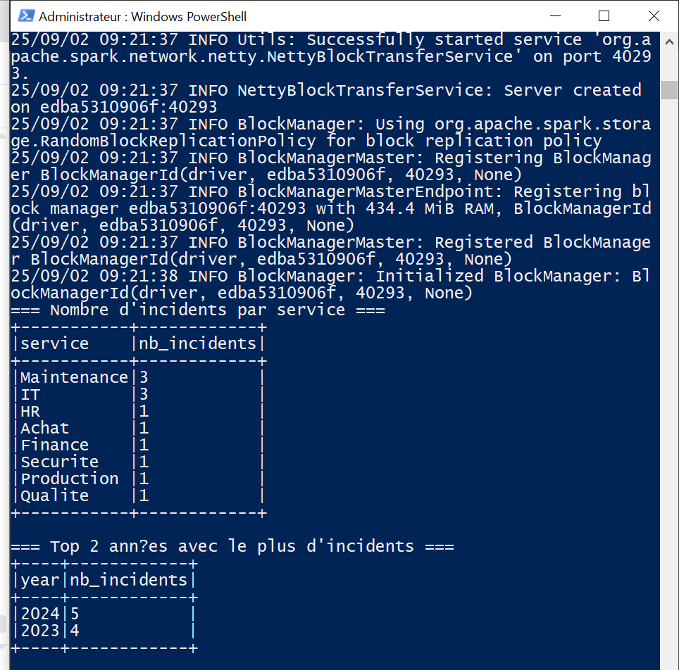

# TP3 — Spark SQL : Analyse d’incidents (local & cluster Docker)

Ce projet **Maven + Java (Spark SQL)** lit un CSV d’incidents et produit :
1) **Le nombre d’incidents par service**
2) **Les deux années** où il y avait **le plus d’incidents**

Format CSV attendu : `id,titre,description,service,date`

Exemple dans [`data/incidents.csv`](data/incidents.csv).

---

## 🧱 Architecture & modes d’exécution

### 1) Exécution locale (développement / test)
- **Driver & executors** tournent dans **le même JVM** sur votre machine.
- Master configuré en **`local[*]`** (dans le code) → simple à lancer depuis IntelliJ.
- Lecture/écriture sur le **système de fichiers local** (ex. `data/`, `output/`).

```
[Votre PC]  Driver + Executors (local[*])
       ↘ lit data/incidents.csv
       ↘ écrit output/{incidents_by_service, top_years}
```

### 2) Exécution sur cluster Spark (Docker Standalone)
- Un **Master** + un (ou plusieurs) **Workers** dans des **conteneurs**.
- Vous soumettez l’application avec **`spark-submit`** (driver côté master).
- Les **données & le JAR** doivent être **accessibles par tous les nœuds** → on utilise un **volume partagé** `./shared` monté en `/shared`.

```
[Host Docker]
  └─ docker-compose (spark-master, spark-worker-1)
        ├─ Volume partagé: ./shared ↔ /shared
        └─ spark-submit (Driver sur master) → Executors sur worker(s)
```

Pourquoi ce design ?
- **Local** : rapidité de test et itération.
- **Cluster** : exécution distribuée, montée en charge, proche de la prod.

---

## 🛠️ Prérequis

- **Java 17+**
- **Maven 3.8+**
- **IntelliJ IDEA** (Community suffit)
- **Docker + docker-compose** (pour le mode cluster)

---

## 📦 Ouverture du projet dans IntelliJ

1. `File` → `Open…` → sélectionnez le dossier **`incidents-spark-sql`**.
2. Laissez IntelliJ importer le projet **Maven**.
3. Ouvrez la classe **`IncidentsApp`** (`src/main/java/.../IncidentsApp.java`).

### ▶️ Lancer en local (IntelliJ)
- Clic droit sur `IncidentsApp` → **Run 'IncidentsApp.main()'**
- Par défaut, le programme lit **`data/incidents.csv`** et écrit dans **`output/`**.
- Vous pouvez aussi **passer des arguments** :
  - **Arg 0** : chemin CSV (ex. `data/incidents.csv`)
  - **Arg 1** : dossier de sortie (ex. `output`)

Exemple (Run configuration → Program arguments) :
```
data/incidents.csv output
```

---

---
### 📷 Captures


---

## 🐳 Exécution sur un cluster Spark (Docker)

### 1) Démarrer le cluster
```bash
docker compose up -d
# UI Master: http://localhost:8080
# UI Worker:  http://localhost:8081
```

### 2) Construire le JAR
```bash
mvn -q -DskipTests package
# Produit: target/incidents-spark-sql-1.0.0.jar
```

### 3) Préparer données & JAR pour le cluster
Copiez le CSV et le JAR dans le **dossier partagé** :
```bash
cp data/incidents.csv shared/incidents.csv
cp target/incidents-spark-sql-1.0.0.jar shared/app.jar
```

### 4) Soumettre le job depuis le Master
```bash
docker exec -it incidents-spark-master bash -lc "
  /opt/bitnami/spark/bin/spark-submit     --master spark://spark-master:7077     --class ma.enset.incidents.IncidentsApp     /shared/app.jar     /shared/incidents.csv     /shared/output
"
```

Résultats écrits dans `shared/output/{incidents_by_service,top_years}` (fichiers CSV).

---

## 🧪 Jeu de données d’exemple

Un petit CSV est fourni dans `data/incidents.csv`. Vous pouvez le remplacer par vos données réelles, tant que l’ordre des colonnes suit :

```
id,titre,description,service,date
```

> **Note sur la date** : l’année est extraite de manière robuste via une regex (`\d{4}`), ce qui supporte des formats comme `2024-03-30`, `30/03/2024`, etc.

---

## 🧾 Sorties attendues

- **`incidents_by_service`** : deux colonnes `service, nb_incidents`
- **`top_years`** : deux colonnes `year, nb_incidents` (top 2)

Les deux sont écrites en **CSV** avec l’option `header=true`.

---

### 📷 Captures



---

## 📚 Stack technique

- **Spark** `${spark.version}` (Spark SQL)
- **Java 17**, **Maven**
- **Docker** (images Bitnami Spark)
- **Mode local** (`local[*]`) & **Standalone cluster** (`spark://spark-master:7077`)

Bon TP ! 🚀
